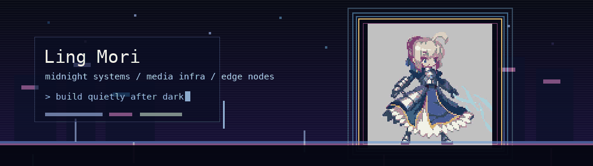

<div align="center">
  
</div>

<p align="center">
  <a href="https://github.com/lingMori">
    
  </a>
  <a href="https://github.com/lingMori?tab=followers">
    
  </a>
  
  
</p>

<p align="center">
  <a href="https://git.io/typing-svg">
    
  </a>
</p>

---

## Hi, I'm Shiro

I'm **Shiro Zhang**, also **Ling Mori** online. I studied Cyber Science and Technology at [Beihang University](https://www.buaa.edu.cn/) and somehow kept wandering toward the same corner of the map, where machine learning systems, Web3 infrastructure, and decentralized edge networks overlap.

The part that keeps pulling me back is not the buzzword layer. It is the engineering underneath. How do we make useful compute cheaper, easier to run, and less fragile when real people start depending on it?

I like quiet tools, readable dashboards, late-night debugging, and the kind of interface that feels like it belongs in a near-future anime lab without becoming hard to use.

## What I'm Into

- Efficient ML systems that do not assume infinite budget.
- Media and entertainment infrastructure where Web3 is useful without getting in the user's way.
- Hybrid networks where cloud machines and edge nodes each do the thing they are good at.
- Small experiments that begin as curiosity and slowly turn into something worth showing.

## Tools I Reach For

<p align="center">
  
</p>

<p align="center">
  
  
  
  
</p>

## A Few Signals

<!-- <p align="center">
  
  
</p> -->

<p align="center">
  
</p>

<p align="center">
  
</p>

## WakaTime

<!--START_SECTION:waka-->

```txt
From: 12 July 2026 - To: 19 July 2026

No activity tracked
```

<!--END_SECTION:waka-->

## Elsewhere

<p align="center">
  <a href="https://github.com/lingMori">
    
  </a>
  <a href="https://steamcommunity.com/id/shirozhang/">
    
  </a>
</p>

<p align="center">
  <sub>This profile is a small desk in a night-colored workshop. A few tools, a few traces, and things still taking shape.</sub>
</p>

<div align="center">
  
</div>
